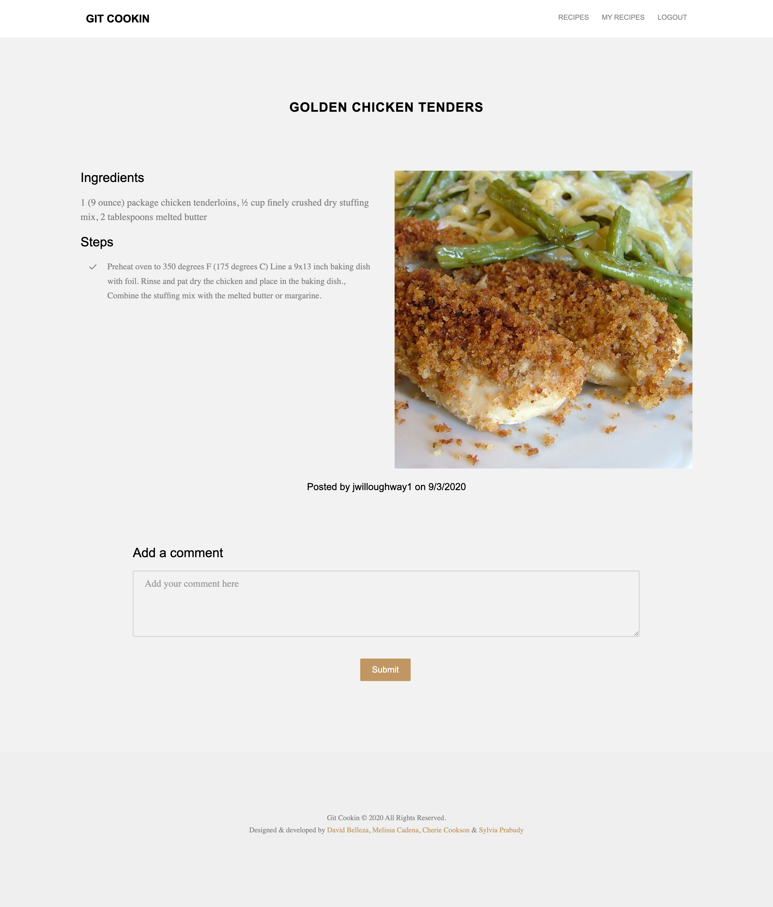
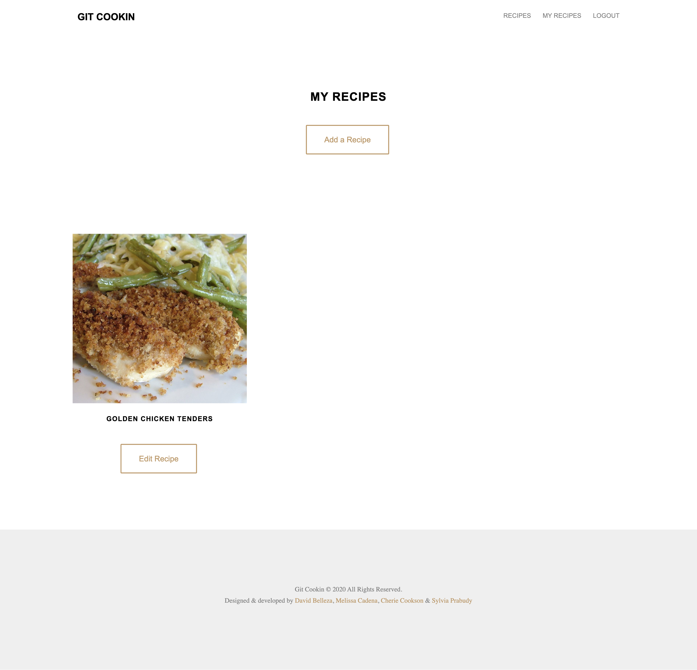
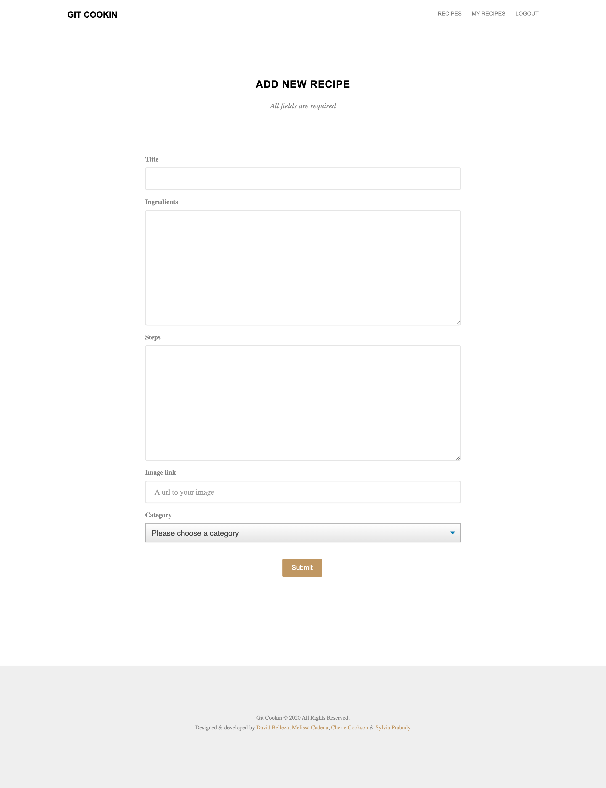
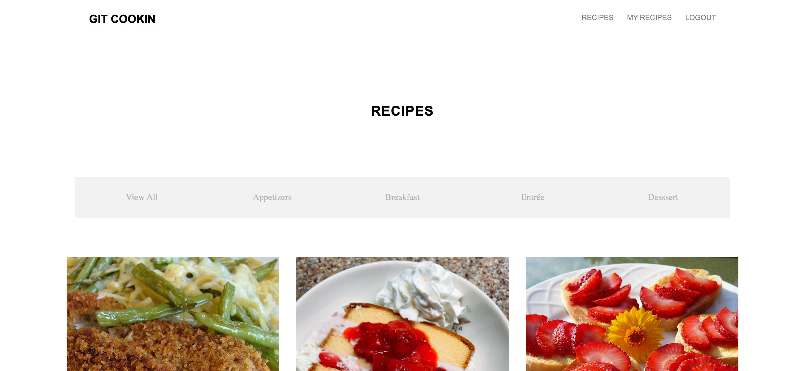

# Git Cookin'

## Deployed app on heroku: 

## Description: 
This application was built to allow users to find new recipes and share their own recipes. On the homepage of the site, the user can see the featured recipes. They also have the ability to view all recipes or to view recipes by category (Appetizers, Breakfast, Entree, and Dessert). If the user would like to share their own recipes or to comment on existing recipes, they can sign up for a Git Cookin account. Once signed up, they will have access to their dashboard which only shows their own added recipes. From the dashboard, they can update or edit existing recipes and add new recipes. When clicking on any recipe, they will get more information including ingredients, recipe steps and all comments. If logged in, they will be able to add their own comments on this page. 

## Table of Contents
* [Built With](#builtwith)
* [Screenshots](#screenshots)
* [Contributing](#contributing)
* [Questions](#questions)

## Built With
* MySQL
* Sequelize
* dotenv
* bcrypt
* Handlebars.js
* JawsDB
* Sass
* Express.js

## Screenshots

* Homepage View
Shows featured recipes. Only has options to login or see recipes until logged in.

* Login Page 
Also has option to sign up instead

* Single Recipe View
When clicking on a recipe, you'll be routed to this view. In ths view, if you are logged in, you can see all comments and add comments to the post.

* Dashboard View
When logged in, you can view your dashboard that shows your recipes. Here you have the ability to edit or delete your recipes.

* Add Recipe View

* Categories View
You can either view all recipes or view by category.

## Contributing
This application was created by <a href="" target="_blank">Michael Correa</a>, 
